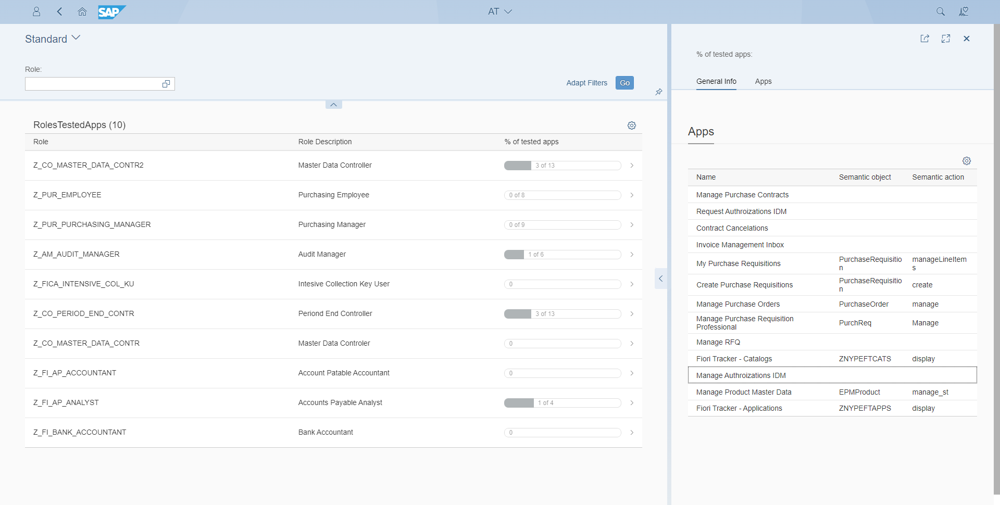

# Spot untested apps automatically

Minimize repeated issues in role transitions to production system.

Fiori Role Testing tracks role testing to ensure the team tests all SAP Fiori applications before production deployment. It uses [Fiori App Usage](https://help.fioriappsusage.org) to log each app's start, confirming it has been tested.

-   :ext-sap-logo-shape:{ .lg .middle } __Hosted in your SAP landscape__

    ---

    Comes as a native SAP Fiori app that you can install on any SAP system. 

    [:octicons-arrow-right-24: Installation](installation.md)

-   :material-clock-fast:{ .lg .middle } __Set up in 1 day__

    ---

    Import the transport requests and follow the guide. Compatible with all SAP S/4HANA releases.

    [:octicons-arrow-right-24: Installation](installation.md)

## Offer

[Get an offer](offer.md){ .md-button .md-button--primary }

[Get it for free](free-offer.md){ .md-button .md-button--primary }

by allowing us to feature your company name as a Fiori Role Testing customer. 

