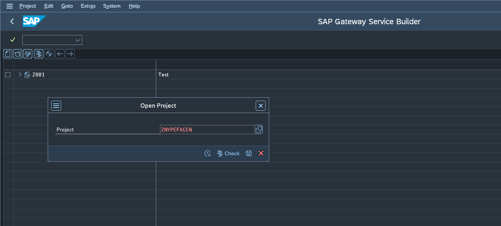
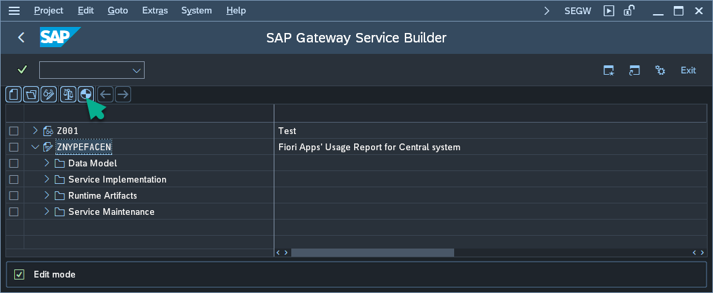
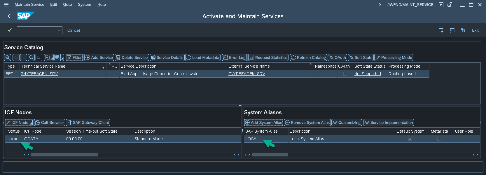
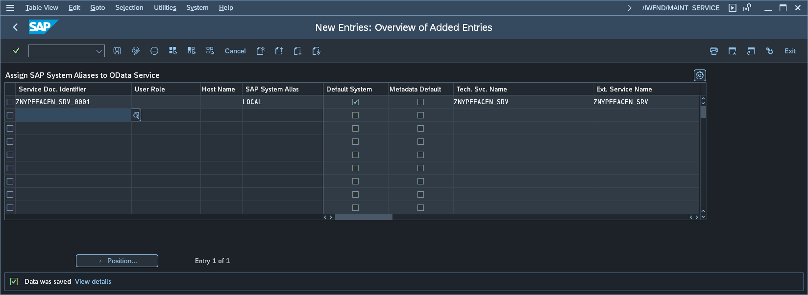
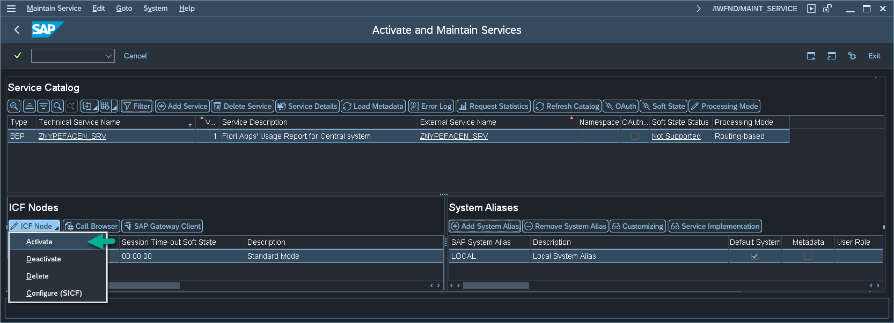
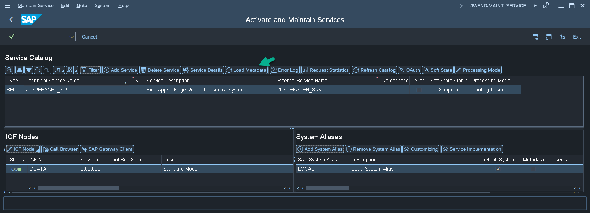

# Step 3 - Enable the oData services

To enable the oData service, complete the sub-steps described below. 

### 1. Generate Runtime objects in transaction SEGW

1.1. Start SAP Gui transaction **SEGW**

1.2. Using the menu *Project > Open* - Open the project named **ZNYPEAT**. 

1.3. Go to Change mode and choose function **Generate** (the system will prompt you for the transport, and you need to register your user as a developer)

### 2. Add the Services to Service Catalog

2.1 Start SAP Gui transaction **/n/IWFND/MAINT_SERVICE**

2.2 Find entry with Service name: **ZNYPEAT_SRV**

If the entry is present, then move to 3, if not, please execute the following steps:

2.3 Click on the **Add service** button.

2.4 Provide System Alias: LOCAL and External Service Name as the **ZNYPEAT_SRV**.

2.5 Select the record with **ZNYPEFACEN_SRV** and click on the Add selected services button.

### 3. Add system alias to ICF node

3.1 In SAP Gui transaction **/n/IWFND/MAINT_SERVICE**, chose **ZNYPEAT_SRV**

3.2 If the ICF node is green and the alias is present, then steps for **ZNYPEAT_SVR** are completed, and you can move to point 3.5, if not, please execute the following steps:

3.3 Choose **Add system alias**, **New entry** and type "ZNYPEAT_SRV_0001" in *Service Doc. Identifier* and "LOCAL" in *SAP System Alias* mark **Default System** check-mark.

3.4 Click on **ICF node** button and from dropdown chose **Activate**

3.5 Click on **Load Metadata** button

 